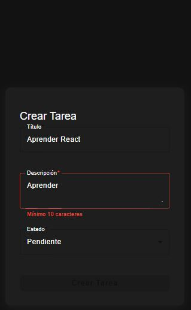
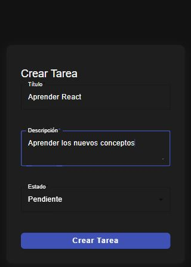

# To-Do App con Angular

Esta es una aplicación web para la gestión de tareas (To-Do List), desarrollada como prueba técnica para un puesto de desarrollador frontend junior. Permite crear, leer, actualizar y eliminar tareas, además de filtrarlas por estado.

---

## Tecnologías utilizadas

- **Angular** 18
- **TypeScript**
- **SCSS**
- **MockAPI** para simular API REST
- **Angular Material** para UI (filtros, inputs, etc.)

---

## Funcionalidades principales

✅ CRUD de tareas:  
&nbsp;&nbsp;&nbsp;&nbsp;• Crear nuevas tareas  
&nbsp;&nbsp;&nbsp;&nbsp;• Editar estado o contenido  
&nbsp;&nbsp;&nbsp;&nbsp;• Eliminar tareas  
&nbsp;&nbsp;&nbsp;&nbsp;• Listado de tareas por tarjetas  

✅ Filtros por estado (Pendiente, En Progreso, Finalizada)  
✅ Búsqueda por título  
✅ Autenticación básica (inicio y cierre de sesión)  
✅ Interfaz responsive y moderna

---

## Capturas de pantalla - Ionic

**Login Usuarios**


**Vista principal**


**Creación de tarea fállida - Validación de longitud en campo**



**Creación de tarea**



**Actualización de una tarea**


---

## Instalación y ejecución

1. **Clonar el repositorio**
```bash
git clone https://github.com/victor-j10/to-do-list.git
cd to-do-list
```

2. **Instalar las dependencias**
```bash
npm install
```

3. **Ejecutar la app**

##  Autenticación
La autenticación es básica (solo frontend), simulada para efectos de la prueba técnica. No se conecta a un sistema de usuarios real.

## API
Las tareas se obtienen desde MockAPI.io, simulando una API REST. Cada tarea tiene:

```bash
{
  "id": "string",
  "title": "string",
  "description": "string",
  "status": "Pendiente | En Progreso | Finalizada"
}
```

## App desplegada

Utilicé Vercel para desplegar la app, si deseas probarla te dejo el link a continuación: https://to-do-list-mu-six-87.vercel.app

## Usuarios de prueba

Para iniciar sesión te dejo los siguientes usuarios:

| Email              | Contraseña |
|--------------------|------------|
| luis@prueba.com    | luis123    |
| ana@prueba.com     | ana123     |
| jose@prueba.com    | jose123    |
| mateo@prueba.com   | mateo123   |
| daniel@prueba.com  | daniel123  |


## Autor
Desarrollado por Victor Hernandez como una prueba técnica.
